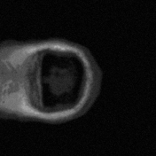

Use of Fractal Geometry in 2D/3D Image Compression
======

This is a project that I pursued for my senior colloquium at Susquehanna University in 2010-2011. The objective of this project was to explore the use of fractal geometry in 2D image compression algorithms. My curiosity led me to extend the scope of this project to include 3D images (particularly CAT scan images). I implemented a 3D compression/decompression algorithm in a fashion similar to the one that I made for 2D images, only to find that the algorithm was so slow it was literally not usable. As a result, I spent some time re-thinking the approach and implemented a slightly different algorithm that had statistically significant improvement in performance than the initial 3D compression algorithm.

Note: I am releasing this software as is. I am aware that the performances of the algorithms can be improved. If this domain of study interests you, please feel free to modify it as you may see fit.

See [NM_Fractal_Talk_2011.pptx](https://github.com/nabinchha/2D-and-3D-fractal-image-compression/blob/master/NM_Fractal_Talk_2011.pptx) for project slides.

Abstract (as written in 2011)
--------
The storage capacity of hard drives has increased significantly in the past decade.  At about 10 cents per gigabyte of storage space, the cost per bit as of today is roughly about a hundred billionth of a dollar. This seemingly cheap cost of storage, however, does not rule out the need for image compression because the size of the images and videos has also increased considerably. Of all image compression techniques, fractal image compression has a fairly high compression ratio. This compression technique makes use of fractals, i.e., self-similarity within the image to compress the image into fractal codes. A compressed fractal code file only consists of the header and the fewest affine transformations necessary to regenerate an approximation of the original image, as opposed to the color intensities of each pixel in the image. This colloquium explores the use of fractal geometry in a basic two-dimensional fractal image compression algorithm, which is implemented and also extended to compress three-dimensional images. 

###### Original 3D CAT scan of a human brain

###### Preview of 3D CAT scan compressed using NM3DFractalImageCompression

